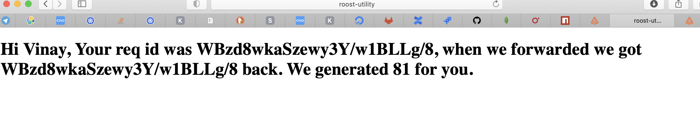
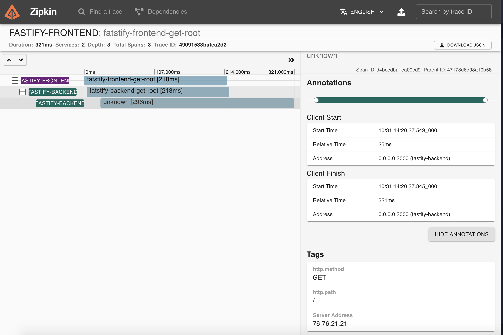
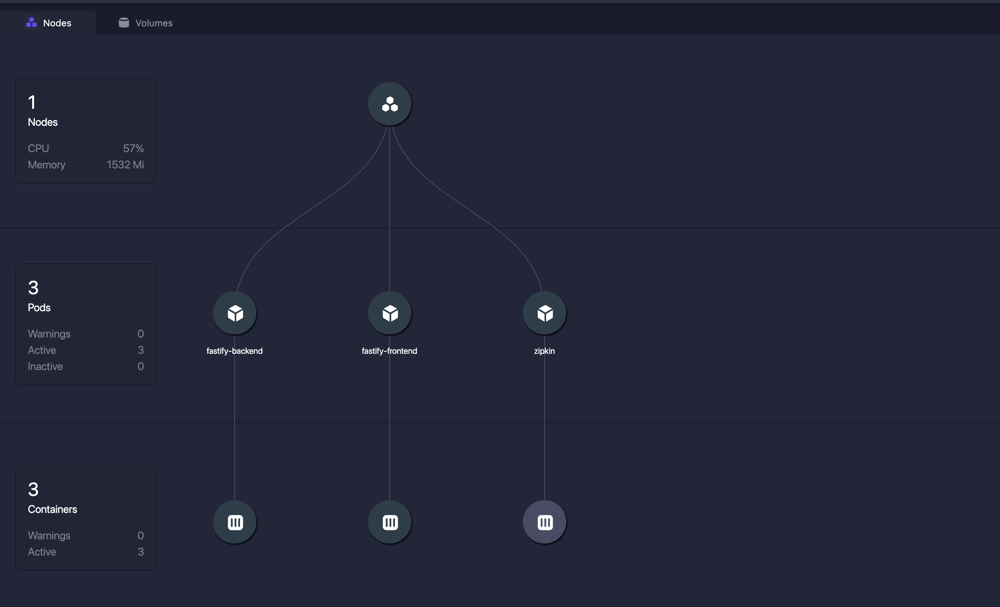

# Example fastify for request tracing and collaborating service with roost.io.

In this repo we have multiple services to demonstrate how to handle request tracing.

The deployment setup is simple
- there is a serverless function `now-random-number` hosted on now.sh. This function simply returns a random number between 0 - 100 in some json.
- there is a hosted service `fastify-backend`. This service makes a request to `now-random-number`, and returns the random number, a name query param that is supplied to the index route and the request id in some json.
- There is a hosted service `fastify-frontend`. this service makes a request to the `fastify-backend` and formats the random number, name property and id into some html and returns it.

the backend and frontend folder should be built with docker and tagged and those docker images pushed to a docker repository.

The backend and frontend service are deployed on kubetnetes. They are exposed to each other using standard kuberenetes services. The config for these is in `deploy.yml`. Replace the relevant docker container references in `deploy.yml` with their pushed image counterparts.

##Instructions
1. Build fastify-backend Docker image 
2. Build fastify-frontend Docker image
3. Deploy fastify-backend/fastify-backend.yaml
4. Deploy fastify-frontend/fastify-frontend.yaml
5. Deploy deploy-zipkin.yaml

Visit http://roost-utility:30001 to see the Demo 
Visit http://roost-utility:30003 to see the distributed traces 

Use the roost.io collaboration feature to share your services/deployments

